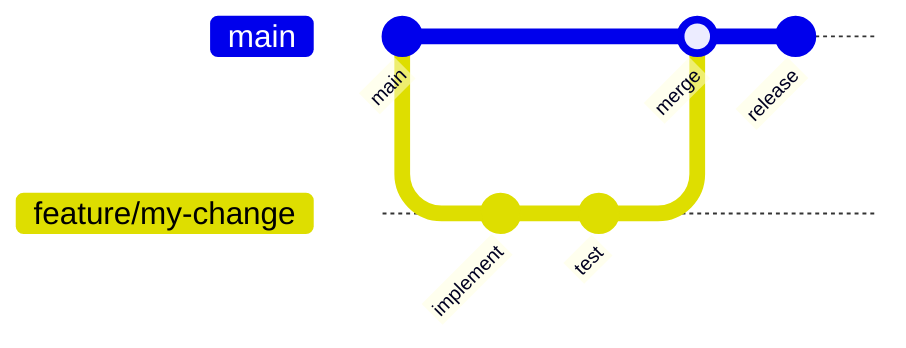
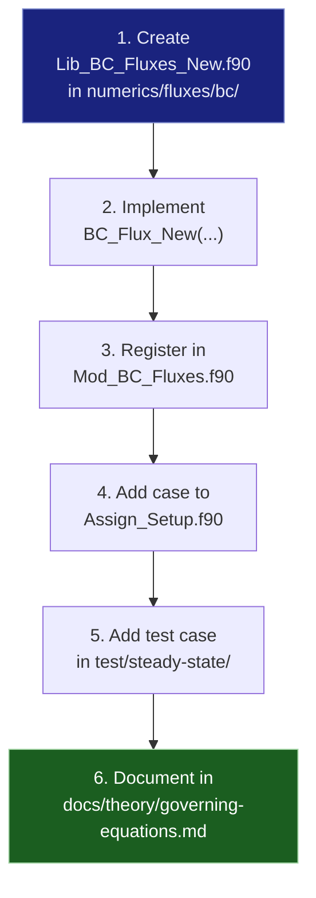
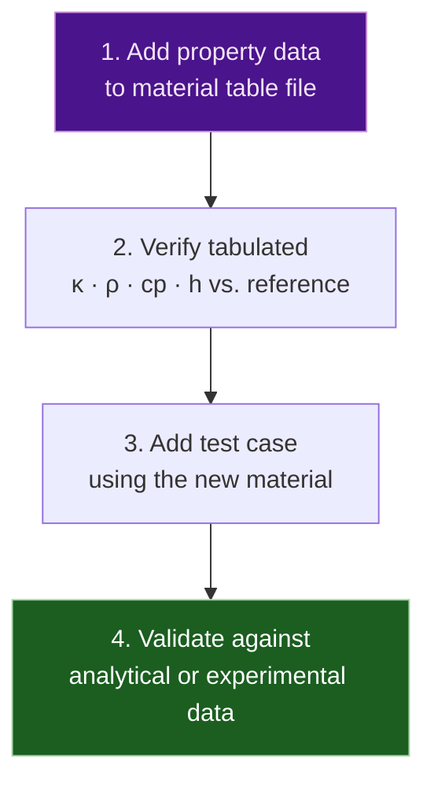
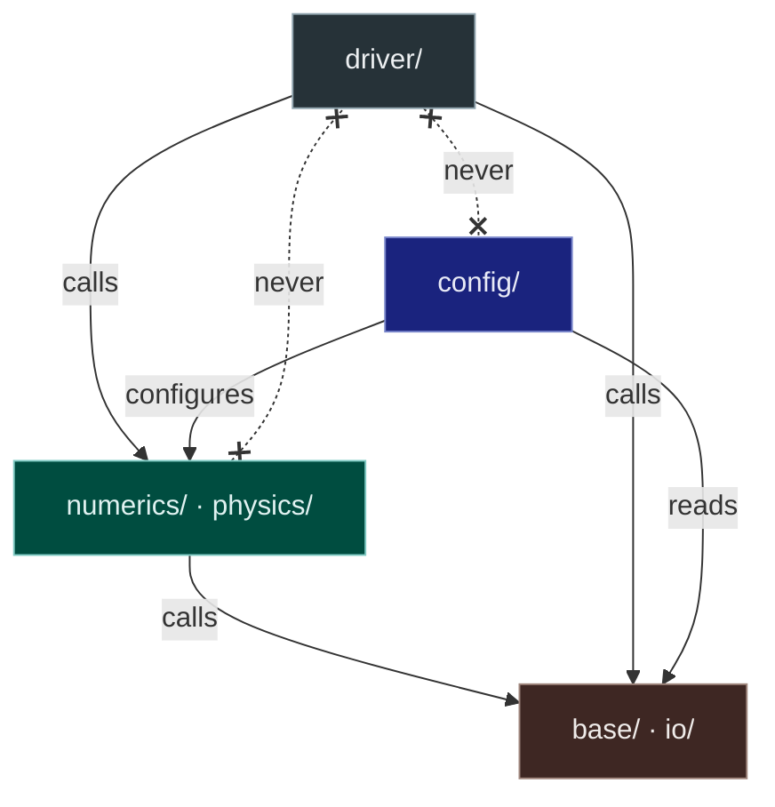

# Contributing

Thank you for your interest in contributing to FUSS.  This page
describes the development workflow, coding conventions, and review
process.

---

## Development Workflow



1. **Fork or branch** — create a feature branch from `main`.
2. **Implement** — make your changes in small, focused commits.
3. **Test** — run the relevant test suite (see [Testing](testing.md)).
4. **Push** — push your branch and open a pull request.
5. **Review** — address feedback; maintainers will merge when ready.

---

## Setting Up a Development Environment

```bash
# 1. Clone with submodules
git clone --recurse-submodules https://github.com/open-hydra/FUSS.git
cd FUSS

# 2. Build in debug mode
./install.sh build --compilers=gnu

# 3. (Optional) Update submodules to latest
./install.sh update --remote

# 4. Iterative recompilation
./install.sh compile
```

!!! tip "CMakePresets.json"

    After the first `install.sh build`, a `CMakePresets.json` is
    generated with your compiler paths and library locations.
    Subsequent builds only need `./install.sh compile` (or
    `cmake --build build`).

---

## Coding Conventions

### Fortran Style

| Rule | Detail |
|------|--------|
| **Standard** | Fortran 2008 (`-std=f2008`) |
| **Line length** | Hard limit of **132 characters**; use `&` continuation |
| **Indentation** | 2 spaces; no tabs |
| **Module naming** | `FUSS_<Name>` for public modules |
| **Variable naming** | `snake_case` for locals; `obj_` prefix for global singletons |
| **Implicit typing** | Always use `implicit none` |
| **Intent** | Declare `intent(in)`, `intent(out)`, or `intent(inout)` for all arguments |
| **Precision** | Use `iso_fortran_env` kinds: `int32`, `real64` |

### File Organisation

- One module per file (exceptions: small helper modules).
- File name matches module name minus the `FUSS_` prefix
  (e.g. `Lib_Solid.f90` → module `FUSS_Lib_Solid`).
- Computational routines go in `Lib_*.f90`; types and pointers in
  `Mod_*.f90`.

### Commit Messages

Use imperative mood, present tense:

```
Add radiation boundary condition with view-factor input

Implement surface-to-ambient radiation BC using the Stefan–Boltzmann
law.  Emissivity and reference temperature are read from input.ini.
Includes test case in test/steady-state/radiative_Rod.
```

---

## Adding a New Boundary Condition

As a concrete example of extending FUSS, here is how to add a new
boundary condition:



1. Create `src/lib/numerics/fluxes/bc/Lib_BC_Fluxes_New.f90` with a
   subroutine matching the boundary-flux interface.
2. Implement the BC; the interface receives the ghost-cell data and
   BC parameters, and updates the ghost cell temperature/flux.
3. In `Mod_BC_Fluxes.f90`, add the new BC type to the dispatch logic.
4. In `config/Assign_Setup.f90`, bind any procedure pointer or
   register the new BC keyword.
5. Add a verification test case with a known analytical solution.
6. Document the mathematical formulation.

---

## Adding a New Material



Material properties are stored in tabulated form and interpolated at
run time by the routines in `Lib_Solid`.  To add a new material:

| Step | Action |
|------|--------|
| Property table | Add temperature-dependent entries for `κ`, `ρ`, `cp`, `h` to the material database file |
| Range | Ensure the table covers the full expected temperature range |
| Validation | Cross-check interpolated values against datasheet or literature |
| Test case | Add a case to `test/` that exercises the new material |

---

## Layer Boundaries

Respect the separation between layers:



- **driver/** calls numerics/physics and io but never config.
- **numerics/** and **physics/** never call upward into driver.
- **config/** configures numerics/physics but does not call driver.
- **base/** is a leaf layer with no upward dependencies.

---

## Pull Request Checklist

Before submitting a PR, please verify:

- [ ] Code compiles with `-std=f2008 -Wall -Wextra` without warnings
- [ ] No line exceeds 132 characters
- [ ] All new subroutines have `implicit none` and argument intents
- [ ] Existing tests pass
- [ ] New functionality has at least one test case
- [ ] Documentation updated if user-facing behaviour changed
- [ ] Commit messages follow the convention above
