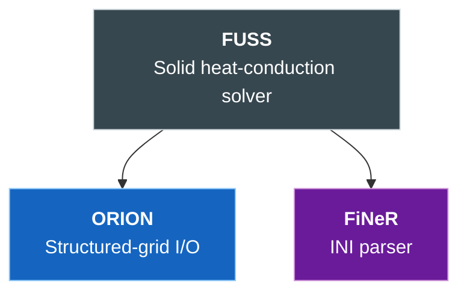
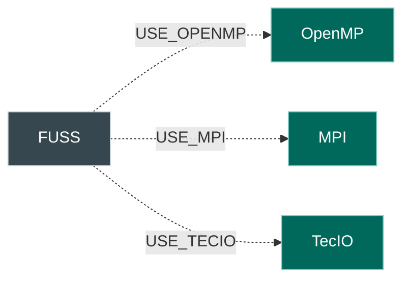
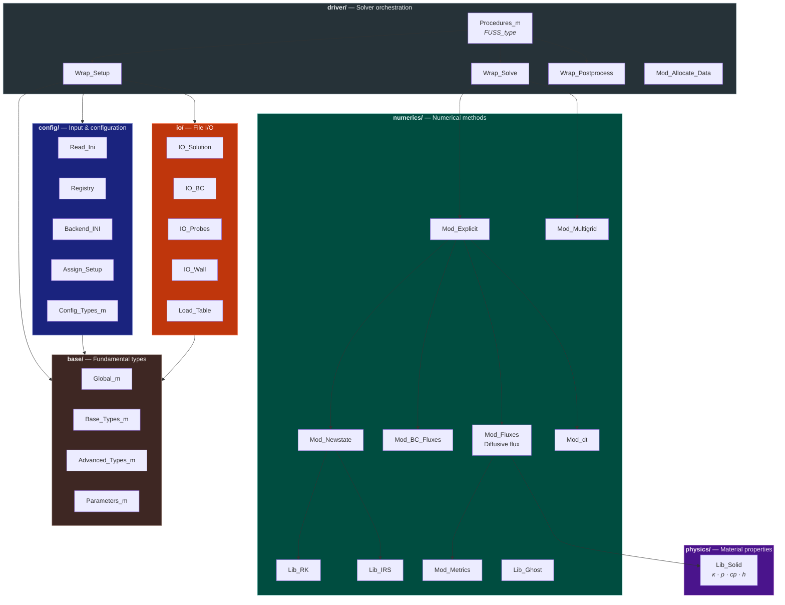
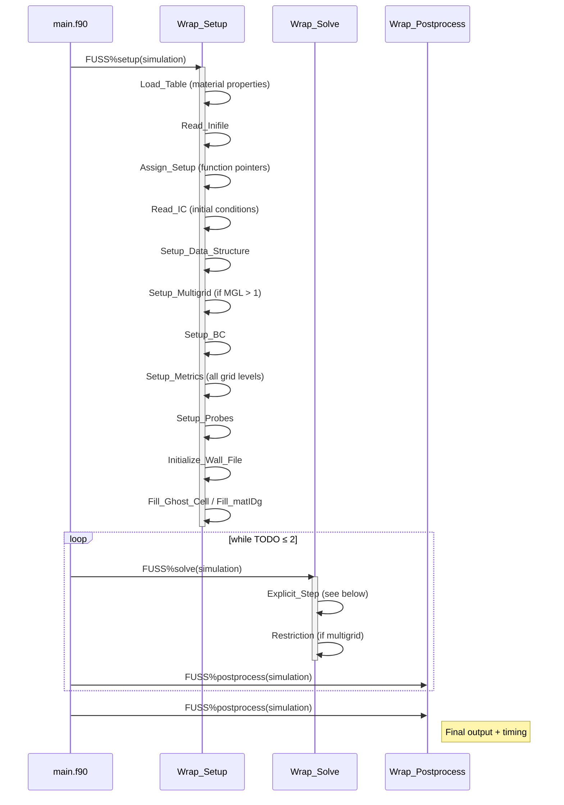
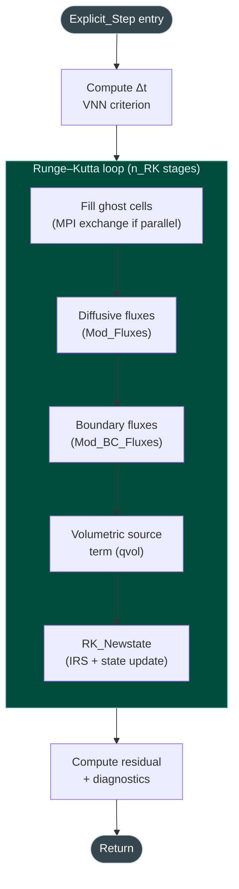
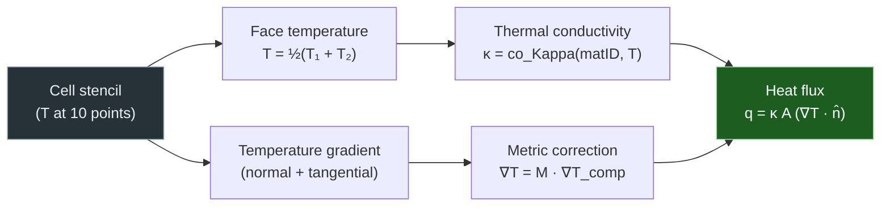
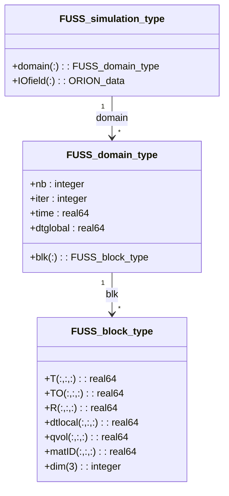
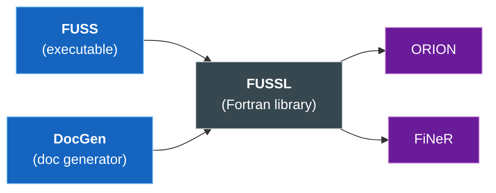

# Code Structure

This page documents the repository layout, the internal architecture
of the FUSS library, and the solver execution pipeline.  All diagrams
use [Mermaid](https://mermaid.js.org/) and render directly in the
documentation.

---

## Repository Layout

```
FUSS/
├── CMakeLists.txt          # Top-level CMake build
├── CMakePresets.json        # Developer presets (compilers, paths)
├── install.sh               # Build / compile / update helper
├── mkdocs.yml               # Documentation site configuration
│
├── src/
│   ├── app/                 # Executables
│   │   ├── main.f90         # FUSS solver entry point
│   │   └── docgen.f90       # Input-parameter documentation generator
│   └── lib/                 # FUSS library (libFUSSL)
│       ├── base/            # Fundamental types and global parameters
│       ├── config/          # Input parsing, registry, setup assignment
│       ├── diagnostic/      # Residual monitoring
│       ├── driver/          # High-level solver orchestration
│       ├── io/              # File I/O (solution, BCs, probes, walls)
│       ├── numerics/        # Numerical methods
│       │   ├── fluxes/      #   Diffusive flux computation
│       │   │   └── bc/      #     Boundary-condition flux routines
│       │   ├── multigrid/   #   Restriction / prolongation
│       │   ├── space/       #   Metrics, ghost-cell filling
│       │   └── time/        #   Time stepping
│       │       └── explicit/#     Runge–Kutta, IRS, state update
│       ├── parallel/        # MPI ghost-cell exchange
│       └── physics/         # Solid material properties
│
├── lib/                     # External dependencies (git submodules)
│   ├── ORION/               # Structured-grid I/O library
│   └── third_party/
│       └── FiNeR/           # INI file parser
│
├── test/                    # Test suite
│   ├── steady-state/        # Steady-state V&V problems (NAFEMS benchmarks)
│   ├── transient/           # Time-accurate V&V problems
│   └── numerics-features/   # Numerical features verification
│       ├── residual_convergence/   # Convergence strategy comparison
│       └── time_convergence/       # Parallel scaling performance
│
├── docs/                    # MkDocs documentation source
├── cmake/                   # CMake modules (flags, OpenMP, MPI, etc.)
├── bin/                     # Built executables (FUSS, DocGen)
└── build/                   # Build artefacts
```

---

## Dependency Graph

The diagram below shows how the FUSS library depends on its
submodules and third-party components.



Optional compile-time dependencies (enabled via CMake flags):



---

## Library Architecture

The FUSS library (`libFUSSL`) is organised in six layers.  Lower
layers have no knowledge of higher layers.



---

## Module Hierarchy

Each source directory contains Fortran modules following a consistent
naming convention:

| Prefix | Role | Example |
|--------|------|---------|
| `Mod_*` | Module defining types, data, and procedure pointers | `Mod_Fluxes`, `Mod_Metrics` |
| `Lib_*` | Library of pure computational routines | `Lib_RK`, `Lib_Diffusive`, `Lib_Solid` |
| `*_m` | Fundamental type/parameter modules | `Global_m`, `Config_Types_m` |
| `Wrap_*` | High-level driver wrappers | `Wrap_Setup`, `Wrap_Solve` |
| `IO_*` | File I/O routines | `IO_Solution`, `IO_BC` |
| `Read_*` | Input file parsing | `Read_Ini` |
| `Load_*` | Database loading | `Load_Table` |

All public symbols are prefixed with `FUSS_` to avoid namespace
collisions when FUSS is linked as a library (e.g. inside HYDRA
coupling).

---

## Solver Pipeline

The main program (`src/app/main.f90`) creates a `FUSS_type` object
and calls three phases: **setup**, **solve** (in a loop), and
**postprocess**.



### Explicit Step

Each call to `Explicit_Step` performs one complete time step with
Runge–Kutta sub-stages:



---

## Diffusive Flux Pipeline

The evaluation of the conductive heat flux at a single cell interface
follows this sequence:



---

## Data Structures

### Simulation container

The top-level data type is `FUSS_simulation_type`, which holds an
array of grid levels (for multigrid) and an I/O container:



| Array | Shape | Content |
|-------|-------|---------|
| `T` | `(ni, nj, nk)` | Temperature at current time step |
| `TO` | `(ni, nj, nk)` | Temperature at previous time step |
| `R` | `(ni, nj, nk)` | Residual (flux accumulator) |
| `dtlocal` | `(ni, nj, nk)` | Local time step per cell |
| `qvol` | `(ni, nj, nk)` | Volumetric heat source term |
| `matID` | `(ni, nj, nk)` | Material ID per cell |

---

## Build System

### CMake targets



| Target | Type | Description |
|--------|------|-------------|
| `FUSSL` | Static library | Core solver + all physics/numerics |
| `FUSS` | Executable | Standalone solver (`src/app/main.f90`) |
| `DocGen` | Executable | Input-parameter docs generator (`src/app/docgen.f90`) |

### Build workflow

```bash
# Option A: install.sh (recommended for first build)
./install.sh build --compilers=gnu

# Option B: CMake presets (for iterative development)
./install.sh compile          # uses CMakePresets.json
# or equivalently:
cmake --preset default && cmake --build build
```

Key CMake options:

| Option | Default | Effect |
|--------|:-------:|--------|
| `USE_OPENMP` | OFF | Enable OpenMP threading |
| `USE_MPI` | OFF | Enable MPI parallelism |
| `USE_TECIO` | OFF | Enable TecIO output format |

### Dependency paths

External library paths are set via CMake cache variables or the
`install.sh --include-*` flags:

| Variable | Default | Library |
|----------|---------|---------|
| `ORION_PATH` | `lib/ORION/` | ORION I/O |
| `FINER_PATH` | `lib/third_party/FiNeR/` | FiNeR INI parser |

---

## Naming Conventions

| Convention | Example | Meaning |
|------------|---------|---------|
| `FUSS_` prefix | `FUSS_Global_m` | Public Fortran module |
| `obj_` prefix | `obj_sim_param` | Global configuration singleton |
| `Lib_` prefix | `Lib_Solid` | Computational routine library |
| `Mod_` prefix | `Mod_Fluxes` | Module with types + pointers |
| `Wrap_` prefix | `Wrap_Solve` | Driver-level wrapper |
| `_m` suffix | `Config_Types_m` | Fundamental type module |
| `_type` suffix | `FUSS_block_type` | Derived type |
