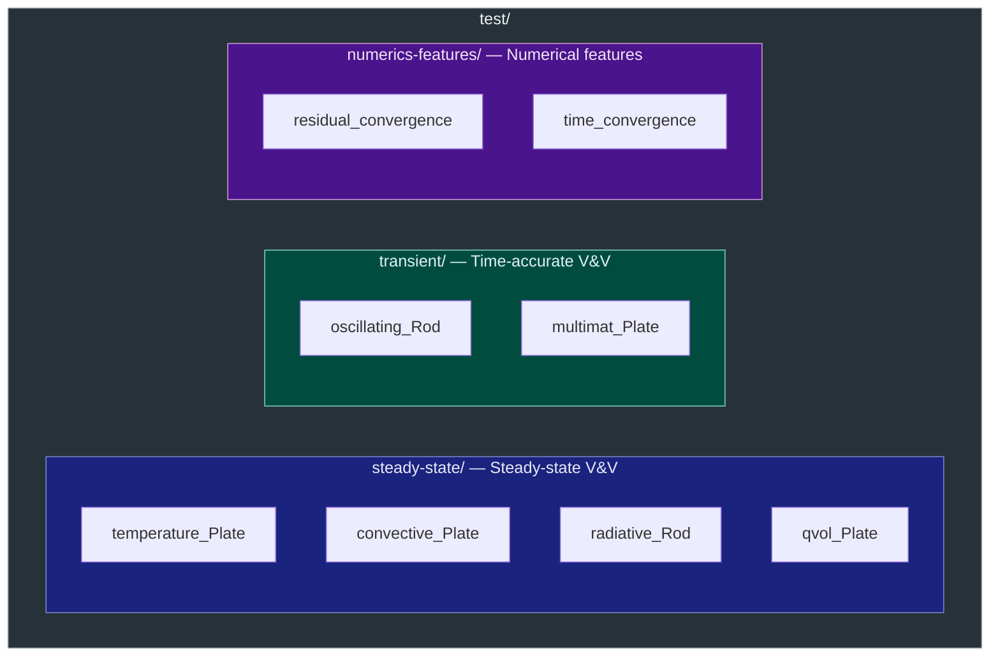
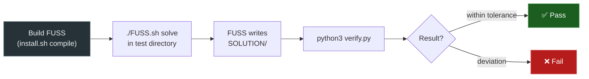

# Testing

FUSS ships with a test suite that exercises the solver on problems
with known analytical or reference solutions, and cases that verify
the behaviour of numerical features.  This page describes the test
organisation, how to run tests, and how to add new cases.

---

## Test Organisation



### Categories

| Category | Location | What is checked |
|----------|----------|-----------------|
| **Steady-state V&V** | `test/steady-state/` | Converged temperature fields against NAFEMS benchmark values or analytical solutions |
| **Transient V&V** | `test/transient/` | Time-accurate temperature histories against analytical Fourier-series solutions |
| **Numerics features** | `test/numerics-features/` | Residual convergence behaviour and parallel scaling performance |

### Steady-state test matrix

| Case | Boundary condition tested | Reference |
|------|--------------------------|-----------|
| `temperature_Plate` | Prescribed temperature | NAFEMS Thermal Test 9(I) – Study 1 |
| `qvol_Plate` | Volumetric heat generation | NAFEMS Thermal Test 9(I) – Study 2 |
| `convective_Plate` | Convective heat transfer (mixed BCs) | NAFEMS Thermal Test 9(I) |
| `radiative_Rod` | Surface radiation (nonlinear BC) | NAFEMS Thermal Test 9(iii) |

### Transient test matrix

| Case | Physics | Reference |
|------|---------|-----------|
| `oscillating_Rod` | 1-D conduction with oscillating wall temperature | NAFEMS Thermal Test 5 |
| `multimat_Plate` | 2-D transient conduction across three-material plate | LANL multi-material diffusion benchmark |

### Numerics-features test matrix

| Case | What is measured | Output |
|------|-----------------|--------|
| `residual_convergence` | Iteration count to convergence for baseline RK3, IRS, and multigrid on coarse and fine meshes | Residual history plot |
| `time_convergence` | Wall-clock time per run across openMP and MPI×openMP configurations | Execution time vs. core count plot |

---

## Test Case Structure

### Verification cases (steady-state / transient)

Each case is a self-contained directory:

```
test/steady-state/temperature_Plate/
├── input.ini          # Solver configuration (time scheme, VNN, BCs, …)
├── INPUT/             # Mesh-coupled initial condition, BC table, material data
├── MESH/              # Pre-generated structured grid
├── OUTPUT/            # Solver output (created at runtime)
├── verify.py          # Comparison script
└── FUSS.sh            # Run helper
```

| File / Dir | Purpose |
|------------|---------|
| `input.ini` | Solver configuration |
| `MESH/` | Pre-generated structured grid |
| `INPUT/` | Initial-condition field, BC table, phase descriptor, property table |
| `OUTPUT/` | Solver output (field, wall, probes, residual history) — used by `verify.py` |
| `verify.py` | Reads solver output, compares against reference, writes figure |
| `FUSS.sh` | Launch wrapper (serial, OpenMP, MPI) |

### Numerics-features cases

These cases do not run the solver directly — they post-process data already stored in `SOLUTION/`:

```
test/numerics-features/residual_convergence/
├── <case>/            # One subdirectory per configuration (coarse, fine, …)
│   └── input.ini
├── SOLUTION/          # Pre-collected residual-history files
└── verify.py          # Reads SOLUTION/, plots residual histories
```

```
test/numerics-features/time_convergence/
├── simdir/            # Reference simulation setup
├── SOLUTION/          # Timing log files (one per parallelisation config)
└── verify.py          # Reads SOLUTION/, plots execution time vs. cores
```

---

## Running Tests

### Single verification case

```bash
cd test/steady-state/temperature_Plate

# Run the solver (serial)
./FUSS.sh solve

# Run with OpenMP (4 threads)
./FUSS.sh -p 4 solve

# Run with MPI (2 ranks)
./FUSS.sh -m 2 solve

# Compare results against reference
python3 verify.py
```

### Numerics-features cases

These scripts read from `SOLUTION/` directly — no solver run needed:

```bash
cd test/numerics-features/residual_convergence
python3 verify.py    # plots residual histories → RESULTS/residual_comparison.svg

cd test/numerics-features/time_convergence
python3 verify.py    # plots execution times → timing_comparison.svg
```

---

## Test Workflow Diagram



---

## Adding a New Test Case

### Steady-state case

1. Create a directory under `test/steady-state/` (e.g. `test/steady-state/MyCase/`).
2. Provide `input.ini`, `MESH/`, and `INPUT/` with the problem setup.
3. Run the solver to generate the solution; store reference output in `SOLUTION/`.
4. Write `verify.py` to compare against the analytical or benchmark solution.
5. Copy `FUSS.sh` from an existing case (it is generic).

### Transient case

Same structure, but place the directory under `test/transient/`.
Set `time-accurate = true` and a `res-threshold` or `iter-threshold` in `input.ini`.
Use point probes (`[FUSS-Probes]`) to record time histories for comparison against analytical solutions.

### Numerics-features case

1. Create a directory under `test/numerics-features/`.
2. Collect solver output (residual histories, log files) into a `SOLUTION/` subfolder
   — one file per configuration, named to encode the configuration (e.g. `MPI-2x10`, `openMP-20`).
3. Write `verify.py` to read `SOLUTION/` directly, parse the relevant quantity,
   and produce a comparison plot saved next to `verify.py`.
4. Document the case in `docs/vv/` following the format of the existing entries.