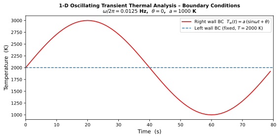
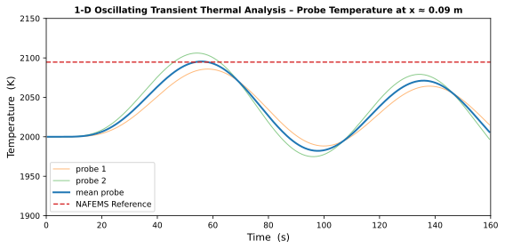

# 1-D Oscillating Transient Thermal Analysis

Transient heat conduction in a one-dimensional rod subjected to a sinusoidally oscillating temperature at its right-hand end and a constant temperature at its left-hand end, starting from a uniform initial temperature. This is NAFEMS Thermal Benchmark Test 5. Verification is performed by tracking the temperature evolution in time at the probe locations nearest to x = 0.09 m and comparing the peak temperature rise against the NAFEMS reference value of 94.69 °C.

**Reference**: NAFEMS Publication P16, "Benchmark Tests for Thermal Analysis", Test 5, YR3087, Vol. 2, 1986.

---

## Problem setup

A rectangular plate (0.1 m × 0.01 m) is modelled as a one-dimensional conduction problem. The right-hand end is subjected to a sinusoidal temperature variation, the left-hand end is held at a constant temperature, and the remaining faces are adiabatic. The domain is initialised with a uniform temperature equal to the left-hand boundary value.

The governing equation for one-dimensional transient conduction is:

$$\rho c_p \frac{\partial T}{\partial t} = k \frac{\partial^2 T}{\partial x^2}$$

**Boundary conditions**

| Face | Location | Condition | Value |
|---|---|---|---|
| Face 1 | x = 0 (left) | Prescribed temperature | T = 2000 K (≡ 0 °C in NAFEMS) |
| Face 2 | x = 0.1 m (right) | Prescribed oscillating temperature | T(t) = 2000 + 1000 sin(2π f t) K |
| Faces 3–6 | lateral faces | Adiabatic (no-flux) | — |

The oscillating BC parameters match the NAFEMS specification:

| Parameter | Symbol | Value |
|---|---|---|
| Frequency | f = ω / 2π | 0.0125 Hz |
| Period | T_period | 80 s |
| Phase offset | θ | 0 |
| Amplitude | a | 1000 °C (= 1000 K) |

The oscillating wall temperature is pre-computed by `bc_time.py` and stored in `Tw_time.dat` as a periodic table of (time, T) pairs spanning one period (0 – 79 s).

**Initial condition**

| Domain | T_init |
|---|---|
| Block 1 (entire rod) | 2000 K (≡ 0 °C in NAFEMS) |

**Material properties**

| Property | Symbol | Value | Unit |
|---|---|---|---|
| Density | ρ | 2300 | kg/m³ |
| Thermal conductivity | k | 1.0 | W/mK |
| Specific heat | cp | 985 | J/kgK |

## Numerical setup

| Parameter | Value |
|---|---|
| Time scheme | RK3 |
| VNN | 0.5 |
| Time-accurate | true |
| Integration variables | primitive |
| Implicit residual smoothing | disabled |
| Simulation end time | 160 s (= 2 oscillation periods) |
| Solution write interval | 10 s |

## Grid structure

The mesh is a 2D structured grid (100 × 2 cells) spanning the physical domain (0.1 m × 0.01 m) with uniform spacing in both directions (Δx = 0.001 m, Δy = 0.005 m). The Y dimension is chosen arbitrarily because the problem is one-dimensional; all lateral faces carry no-flux conditions.

Boundary conditions (FUSS block-face notation):

- **Face 1** (x = 0): Prescribed wall temperature (`type = wall`, `T = 2000`)
- **Face 2** (x = 0.1 m): Prescribed wall temperature, time-varying (`type = wall`, `T-timefile = Tw_time.dat`)
- **Faces 3–6**: `null` (degenerate 2-D y- and z-directions; effectively adiabatic)

## Probes

Two point probes record the temperature history with a time step of 0.1 s:

| Probe | Grid index (block, i, j, k) | Nominal x position |
|---|---|---|
| p1 | 1, 90, 1, 1 | x ≈ 0.0895 m |
| p2 | 1, 91, 1, 1 | x ≈ 0.0905 m |

The probe output files are written to `OUTPUT/p1.txt` and `OUTPUT/p2.txt` as two-column (time, T) ASCII files.

## Boundary condition evolution

The figure below shows one full period of the oscillating right-wall temperature as defined by `Tw_time.dat`, together with the fixed left-wall temperature. The signal reaches a maximum of +1000 °C above the baseline at t = 20 s (quarter period).

## Probe temperature evolution

The figure below shows the temperature recorded at probes p1 and p2 and their arithmetic mean throughout the simulation, plotted as the deviation from the baseline temperature. The NAFEMS reference maximum at x = 0.09 m is shown as a dashed horizontal line for comparison.

## Results and verification

The verification quantity is the maximum temperature rise above the baseline recorded by the mean of probes p1 and p2 during the simulation. This is compared to the NAFEMS benchmark value of 94.69 °C at x = 0.09 m.

| Location | NAFEMS reference | FUSS (mean probe) | Error |
|---|---|---|---|
| x = 0.09 m | 94.69 °C | — | — |

> The table above is populated automatically when `verify.py` is executed. The relative-error threshold for PASS is 1 %.

The thermal diffusivity of the material is:

$$\alpha = \frac{k}{\rho c_p} = \frac{1.0}{2300 \times 985} \approx 4.41 \times 10^{-7}\ \text{m}^2/\text{s}$$

The corresponding thermal penetration depth for the oscillating signal of frequency f is:

$$\delta = \sqrt{\frac{\alpha}{\pi f}} = \sqrt{\frac{4.41 \times 10^{-7}}{\pi \times 0.0125}} \approx 3.35 \times 10^{-3}\ \text{m}$$

The probes at x ≈ 0.09 m lie at a distance of 0.01 m from the oscillating boundary, which is approximately 3 penetration depths, consistent with the attenuated but measurable response predicted by the NAFEMS benchmark.
