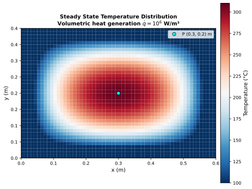

# 2-D Steady State Temperature Distribution in a Plate with Volumetric Heat Generation

Steady-state heat conduction in a rectangular solid plate with prescribed temperatures of 0 °C on all four edges and a uniform internal heat generation rate. This is a two-dimensional Poisson problem whose reference solution is provided by the NAFEMS P16 thermal benchmark suite (Study 2). Verification is performed by bilinear interpolation of the computed temperature field at point B (x = 0.3 m, y = 0.2 m) and comparison against the NAFEMS reference value of 310.1 °C.

**Reference**: NAFEMS Publication P16, "Benchmark Tests for Thermal Analysis", Test 9 (I) and 9 (ii), YR3087, Vol. 2, 1986.

---

## Problem setup

A rectangular plate (0.6 m × 0.4 m) has all four edges held at 0 °C (273.15 K). A uniform volumetric heat generation rate of $\dot{q} = 10^6$ W/m³ is applied throughout the entire plate. The steady state corresponds to the balance between heat generation and conduction losses through the boundaries.

The governing equation for two-dimensional steady-state conduction with internal heat generation is:

$$\frac{\partial^2 T}{\partial x^2} + \frac{\partial^2 T}{\partial y^2} + \frac{\dot{q}}{k} = 0$$

where $\dot{q} = 10^6$ W/m³ and $k = 52$ W/mK. The symmetry of the domain and boundary conditions produces a maximum temperature at the geometric centre (x = 0.3 m, y = 0.2 m), coinciding with target point B.

**Boundary conditions**

| Face | Location | Condition | Value |
|---|---|---|---|
| Face 1 | x = 0 (left) | Prescribed temperature | T = 0 °C (273.15 K) |
| Face 2 | x = 0.6 m (right) | Prescribed temperature | T = 0 °C (273.15 K) |
| Face 3 | y = 0 (bottom) | Prescribed temperature | T = 0 °C (273.15 K) |
| Face 4 | y = 0.4 m (top) | Prescribed temperature | T = 0 °C (273.15 K) |

**Material properties and source term**

| Property | Symbol | Value | Unit |
|---|---|---|---|
| Thermal conductivity | k | 52.0 | W/mK |
| Density | ρ | 7850 | kg/m³ |
| Specific heat | cp | 460 | J/kgK |
| Volumetric heat generation | q̇ | 1 × 10⁶ | W/m³ |

## Numerical setup

| Parameter | Value |
|---|---|
| Time scheme | RK3 |
| VNN | 2.0 |
| Steady-state convergence | time-accurate = false |
| Integration variables | conservative |
| Implicit residual smoothing | enabled (β = 0.5) |
| Residual threshold | 1 × 10⁻⁸ |

## Grid structure

The mesh is a 2D structured grid (60 × 40 cells) spanning the physical domain (0.6 m × 0.4 m) with uniform spacing in both directions (Δx = 0.01 m, Δy = 0.01 m).

Boundary conditions (FUSS block-face notation):

- **Face 1** (x = 0): Prescribed wall temperature (`type = wall`, `T = 273.15`)
- **Face 2** (x = 0.6 m): Prescribed wall temperature (`type = wall`, `T = 273.15`)
- **Face 3** (y = 0): Prescribed wall temperature (`type = wall`, `T = 273.15`)
- **Face 4** (y = 0.4 m): Prescribed wall temperature (`type = wall`, `T = 273.15`)
- **Faces 5–6**: `null` (degenerate 2-D z-direction)

The volumetric heat source is set via the initial condition block (`qvol = 1e6` W/m³).

## Temperature field

The steady-state temperature distribution is shown below. The symmetric heat generation with uniform cold-wall boundary conditions produces a smooth bell-shaped profile with peak temperature at the geometric centre of the plate. Point B, located at the centre (x = 0.3 m, y = 0.2 m), is marked.

## Results and verification

The target point B is located at (x = 0.3 m, y = 0.2 m), the geometric centre of the plate. Because the mesh has an even number of cells in both directions (60 × 40), the point falls exactly at the intersection of four equidistant cell centres (at x = 0.295 m / 0.305 m and y = 0.195 m / 0.205 m). The bilinear interpolation reduces to a simple arithmetic mean of the four surrounding values, which are all identical by symmetry.

| Cell centre | T_FUSS |
|---|---|
| (0.295, 0.195) | 309.98 °C |
| (0.305, 0.195) | 309.98 °C |
| (0.295, 0.205) | 309.98 °C |
| (0.305, 0.205) | 309.98 °C |

| Location | NAFEMS | FUSS (interpolated) | Error |
|---|---|---|---|
| B (x = 0.3 m, y = 0.2 m) | 310.10 °C | 309.98 °C | 0.021 % |

The interpolated temperature at point B agrees with the NAFEMS reference to within 0.12 °C (0.02 % relative error), demonstrating excellent accuracy for the two-dimensional Poisson problem with uniform heat generation and Dirichlet boundary conditions.