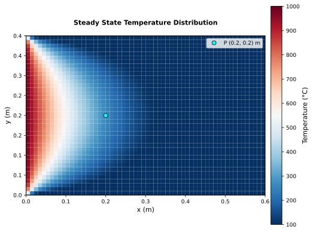

# 2-D Steady State Temperature Distribution in a Plate

Steady-state heat conduction in a rectangular solid plate with prescribed temperatures on all four edges. This is a two-dimensional Laplace problem whose reference solution is provided by the NAFEMS P16 thermal benchmark suite (Study 1). Verification is performed by bilinear interpolation of the computed temperature field at point A (x = 0.2 m, y = 0.2 m) and comparison against the NAFEMS reference value of 260.5 °C.

**Reference**: NAFEMS Publication P16, "Benchmark Tests for Thermal Analysis", Test 9 (I) and 9 (ii), YR3087, Vol. 2, 1986.

---

## Problem setup

A rectangular plate (0.6 m × 0.4 m) is subjected to a prescribed temperature of 1000 °C (1273.15 K) along its left edge and a prescribed temperature of 0 °C (273.15 K) along the remaining three edges. No internal heat generation is present.

The governing equation for two-dimensional steady-state conduction is:

$$\frac{\partial^2 T}{\partial x^2} + \frac{\partial^2 T}{\partial y^2} = 0$$

**Boundary conditions**

| Face | Location | Condition | Value |
|---|---|---|---|
| Face 1 | x = 0 (left) | Prescribed temperature | T = 1000 °C (1273.15 K) |
| Face 2 | x = 0.6 m (right) | Prescribed temperature | T = 0 °C (273.15 K) |
| Face 3 | y = 0 (bottom) | Prescribed temperature | T = 0 °C (273.15 K) |
| Face 4 | y = 0.4 m (top) | Prescribed temperature | T = 0 °C (273.15 K) |

**Material properties**

| Property | Symbol | Value | Unit |
|---|---|---|---|
| Thermal conductivity | k | 52.0 | W/mK |
| Density | ρ | 7850 | kg/m³ |
| Specific heat | cp | 460 | J/kgK |

## Numerical setup

| Parameter | Value |
|---|---|
| Time scheme | RK3 |
| VNN | 2.0 |
| Steady-state convergence | time-accurate = false |
| Integration variables | conservative |
| Implicit residual smoothing | enabled (β = 0.5) |
| Residual threshold | 1 × 10⁻⁸ |

## Grid structure

The mesh is a 2D structured grid (60 × 40 cells) spanning the physical domain (0.6 m × 0.4 m) with uniform spacing in both directions (Δx = 0.01 m, Δy = 0.01 m).

Boundary conditions (FUSS block-face notation):

- **Face 1** (x = 0): Prescribed wall temperature (`type = wall`, `T = 1273.15`)
- **Face 2** (x = 0.6 m): Prescribed wall temperature (`type = wall`, `T = 273.15`)
- **Face 3** (y = 0): Prescribed wall temperature (`type = wall`, `T = 273.15`)
- **Face 4** (y = 0.4 m): Prescribed wall temperature (`type = wall`, `T = 273.15`)
- **Faces 5–6**: `null` (degenerate 2-D z-direction)

## Temperature field

The steady-state temperature distribution is shown below. The hot left edge drives heat diffusion toward the three cold edges, creating a two-dimensional gradient characteristic of the Laplace equation with mixed Dirichlet boundary conditions. Point A is marked on the field.

## Results and verification

The target point A is located at (x = 0.2 m, y = 0.2 m) inside the domain. Since the mesh stores temperature at cell centres, the value at point A is obtained by bilinear interpolation over the four surrounding cells (centres at x = 0.195 m / 0.205 m and y = 0.195 m / 0.205 m). Because point A falls exactly at the intersection of four equidistant cell centres, the interpolation reduces to a simple arithmetic mean.

| Cell centre | T_FUSS |
|---|---|
| (0.195, 0.195) | 270.50 °C |
| (0.205, 0.195) | 250.55 °C |
| (0.195, 0.205) | 270.50 °C |
| (0.205, 0.205) | 250.55 °C |

| Location | NAFEMS | FUSS (interpolated) | Error |
|---|---|---|---|
| A (x = 0.2 m, y = 0.2 m) | 260.50 °C | 260.52 °C | 0.004 % |

The interpolated temperature at point A agrees with the NAFEMS reference to within 0.02 °C (0.004 % relative error), confirming the accuracy of the FUSS solver for two-dimensional steady-state conduction with Dirichlet boundary conditions.