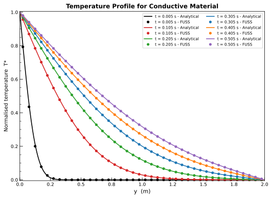

# 2-D Transient Multi-Material Plate

Transient heat conduction across a rectangular plate composed of three material layers aligned with the Y direction. The two outer blocks (Block 1 and Block 3) are made of a near-perfect insulator (k → 0), so heat flows exclusively through the central conductive block (Block 2). The problem therefore reduces to one-dimensional transient conduction in Y for Block 2, for which an exact Fourier-series solution exists. Verification is performed by comparing the numerical temperature profiles along Y in the central column of Block 2 at six time instants against the analytical solution.

**Reference**: "Some New Verification Test Problems for Multi-Material Diffusion on Meshes that are Non-Aligned with Material Interfaces", LANL report (see `reference/`).

---

## Problem setup

A rectangular plate (2.0 m × 2.0 m) is partitioned into three material zones in the X direction:

| Block | X extent | Material | Role |
|---|---|---|---|
| Block 1 | −1.0 to −0.25 m | Insulator (k ≈ 0) | Thermally transparent layer |
| Block 2 | −0.25 to  0.25 m | Conductor (k = 1) | Active conduction zone |
| Block 3 |  0.25 to  1.0 m | Insulator (k ≈ 0) | Thermally transparent layer |

Because the two outer blocks are nearly perfectly insulating, no heat crosses the Block 1 / Block 2 and Block 2 / Block 3 interfaces in the X direction. The temperature field inside Block 2 is therefore uniform in X and governed by one-dimensional transient conduction in Y.

The governing equation inside Block 2 is:

$$\rho c_p \frac{\partial T}{\partial t} = k \frac{\partial^2 T}{\partial y^2}$$

with thermal diffusivity:

$$\alpha = \frac{k}{\rho c_p} = \frac{1.0}{1.0 \times 1.0} = 1.0\ \text{m}^2/\text{s}$$

**Boundary conditions**

| Face | Location | Condition | Value |
|---|---|---|---|
| Face 3 | y = 0 (bottom) | Prescribed temperature – hot wall | T = 101 K |
| Face 4 | y = 2 m (top) | Prescribed temperature – cold wall | T = 100 K |
| Face 1 (Block 1) | x = −1 m | Adiabatic | q = 0 |
| Face 2 (Block 3) | x = +1 m | Adiabatic | q = 0 |
| Block interfaces | x = ±0.25 m | Continuity (`connection`) | — |
| Faces 5–6 | z-direction | No-flux (2-D plane) | — |

**Initial condition**

| Domain | T_init |
|---|---|
| All blocks | 100 K (uniform, equal to cold-wall temperature) |

**Material properties**

| Material | k (W/mK) | ρ (kg/m³) | c_p (J/kgK) | α (m²/s) |
|---|---|---|---|---|
| Insulator | 1 × 10⁻¹² | 1.0 | 1.0 | ≈ 0 |
| Conductor | 1.0 | 1.0 | 1.0 | 1.0 |

## Analytical solution

The normalised temperature T* = (T − T_cold) / (T_hot − T_cold) satisfies:

$$\frac{\partial T^*}{\partial t} = \alpha \frac{\partial^2 T^*}{\partial y^2}, \quad T^*(0, t) = 1, \quad T^*(L, t) = 0, \quad T^*(y, 0) = 0$$

with L = 2 m and α = 1 m²/s. The exact solution is the superposition of the steady-state linear profile and a transient Fourier series:

$$T^*(y, t) = \underbrace{1 - \frac{y}{L}}_{\text{steady state}} + \sum_{r=1}^{\infty} A_r \sin\!\left(\frac{r\pi y}{L}\right) \exp\!\left(-\frac{r^2\pi^2\alpha t}{L^2}\right)$$

with:

$$A_r = \frac{2}{r\pi}\left[(-1)^r T_L - T_0\right] = \frac{-2}{r\pi}\,(-1)^r$$

The series is truncated at 100 terms (implemented in `analytical.py` and inlined in `verify.py`).

## Numerical setup

| Parameter | Value |
|---|---|
| Time scheme | RK3 |
| VNN | 0.8 |
| Time-accurate | true |
| Integration variables | primitive |
| Implicit residual smoothing | disabled |
| Simulation end time | 0.505 s |
| Solution write interval | every 10 iterations |

## Grid structure

Three connected structured blocks with uniform spacing:

| Block | Cells (nx × ny) | X extent (m) | Δx (m) |
|---|---|---|---|
| Block 1 | 15 × 40 | −1.0 to −0.25 | 0.05 |
| Block 2 | 10 × 40 | −0.25 to  0.25 | 0.05 |
| Block 3 | 15 × 40 |  0.25 to  1.0 | 0.05 |

All blocks share ny = 40 cells over the 2 m height, giving Δy = 0.05 m. Blocks are connected via `connection` (continuity) interfaces. The Z dimension is 0.01 m (one cell, 2-D plane).

## Verification approach

The simulation writes a full field solution every 10 solver iterations. The following six snapshots are compared against the analytical solution:

| File | t (s) |
|---|---|
| `field1.tec`   | 0.005 |
| `field21.tec`  | 0.105 |
| `field41.tec`  | 0.205 |
| `field61.tec`  | 0.305 |
| `field81.tec`  | 0.405 |
| `field101.tec` | 0.505 |

For each snapshot `verify.py`:
1. Parses the Tecplot ASCII file and extracts Block 2.
2. Reads the cell-centred temperature at the central I column (i = 5, x ≈ +0.025 m).
3. Normalises: T* = (T − 100) / (101 − 100).
4. Evaluates the analytical T* at the same Y cell-centre positions.
5. Computes the L-inf and L2 errors over the 40 cells in Y.

A PASS is issued when the maximum L-inf error across all six snapshots is below 0.02 (in normalised units, equivalent to 2 % of the applied temperature difference).

## Results and verification

The comparison between the FUSS numerical profiles (open circles) and the analytical solution (solid lines) at all six times is shown below.

Summary of errors:

| File | t (s) | L-inf error | L2 error |
|---|---|---|---|
| `field1.tec`   | 0.005 | 0.017700 | 0.003664 |
| `field21.tec`  | 0.105 | 0.000775 | 0.000352 |
| `field41.tec`  | 0.205 | 0.000396 | 0.000212 |
| `field61.tec`  | 0.305 | 0.000267 | 0.000159 |
| `field81.tec`  | 0.405 | 0.000205 | 0.000133 |
| `field101.tec` | 0.505 | 0.000171 | 0.000118 |

The largest error occurs at t = 0.005 s, when the steep gradient near y = 0 is underresolved on the Δy = 0.05 m grid (the thermal diffusion length at this early time is √(αt) ≈ 0.07 m, comparable to one cell). All subsequent snapshots have L-inf errors below 0.001, confirming that FUSS accurately reproduces one-dimensional transient conduction across a multi-material interface for a range of times.
