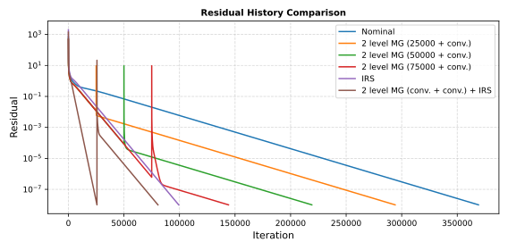

# Residual Convergence – Numerical Acceleration Strategies

Steady-state heat conduction across a two-material plate in the X direction. The physical problem is simple enough to admit an exact analytical solution, which makes it an ideal vehicle for assessing the convergence behaviour of different numerical acceleration strategies available in FUSS: baseline explicit RK3, implicit residual smoothing (IRS), and multigrid. Five configurations are compared — varying the mesh resolution, the IRS flag, and the multigrid option — all driven to the same residual threshold of 1 × 10⁻⁸.

---

## Problem setup

A rectangular plate (1.0 m × 0.1 m × 0.01 m) is partitioned into two material zones in the X direction:

| Block | X extent (m) | Material | k (W/mK) | ρ (kg/m³) | c_v (J/kgK) |
|---|---|---|---|---|---|
| Block 1 | 0.0 – 0.5 | mat1 | 10.0 | 8000 | 450 |
| Block 2 | 0.5 – 1.0 | mat2 | 100.0 | 8000 | 450 |

The two blocks are connected at x = 0.5 m via a `connection` (continuity) interface. No heat flux crosses the remaining faces (2-D plane geometry).

**Boundary conditions**

| Face | Location | Condition | Value |
|---|---|---|---|
| Face 1 – Block 1 | x = 0.0 m | Prescribed temperature – cold wall | T = 1000 K |
| Face 2 – Block 2 | x = 1.0 m | Prescribed temperature – hot wall  | T = 2000 K |
| All other faces   | y, z directions | Adiabatic (2-D plane) | q = 0 |

**Initial condition**

| Domain | T_init |
|---|---|
| All blocks | 1500 K (uniform) |

## Analytical solution

At steady state, the heat flux q is uniform and determined by the total thermal resistance of the two layers in series:

$$q = \frac{T_\text{hot} - T_\text{cold}}{L_1/k_1 + L_2/k_2} = \frac{2000 - 1000}{0.5/10 + 0.5/100} = \frac{1000}{0.055} \approx 18182\ \text{W/m}^2$$

The interface temperature is:

$$T_\text{int} = T_\text{cold} + q\,\frac{L_1}{k_1} = 1000 + 18182 \times 0.05 \approx 1909\ \text{K}$$

The temperature profile is piecewise linear in each block:

$$T(x) = \begin{cases} 1000 + 1818\,x & 0 \le x \le 0.5\ \text{m} \\ 2000 - 182\,(1-x) & 0.5 \le x \le 1.0\ \text{m} \end{cases}$$

## Cases and numerical setup

All cases use RK3 time-marching in pseudo-time (time-accurate = false) with primitive integration variables and are run until the energy residual drops below the threshold res-threshold = 1 × 10⁻⁸. The cases differ in mesh resolution, IRS activation, and multigrid:

| Case | Grid per block (nx × ny) | Total cells | Time scheme | VNN | IRS | IRS β | Multigrid levels |
|---|---|---|---|---|---|---|---|
| coarse        | 50 × 5  | 500  | RK3 | 0.5 | No  | —   | — |
| fine          | 100 × 10 | 2000 | RK3 | 0.5 | No  | —   | — |
| irs_coarse    | 50 × 5  | 500  | RK3 | 2.0 | Yes | 0.5 | — |
| irs_fine      | 100 × 10 | 2000 | RK3 | 2.0 | Yes | 0.5 | — |
| multigrid_fine | 100 × 10 | 2000 | RK3 | 0.5 | No  | —   | 2 |

IRS (Implicit Residual Smoothing) allows a larger effective CFL number by filtering the explicit residual before the update step. The multigrid strategy uses 2 levels, advancing the coarse-grid correction for up to 25 000 iterations per multigrid cycle.

## Results

Residual convergence histories for all five cases are shown below.

Summary of iterations required to reach res-threshold = 1 × 10⁻⁸:

| Case | Initial residual | Final residual | Iterations |
|---|---|---|---|
| coarse        | 4.87 × 10² | ~1.0 × 10⁻⁸ |  95 791 |
| fine          | 6.88 × 10² | ~1.0 × 10⁻⁸ | 369 089 |
| irs_coarse    | 1.42 × 10³ | ~1.0 × 10⁻⁸ |  25 713 |
| irs_fine      | 2.00 × 10³ | ~1.0 × 10⁻⁸ |  99 305 |
| multigrid_fine | 4.87 × 10² | ~1.0 × 10⁻⁸ | 294 094 |

**Key observations**

- **Grid refinement** roughly quadruples the number of iterations required when going from coarse to fine (95 791 → 369 089, ratio ≈ 3.85), consistent with the expected O(Δx²) spectral radius degradation on the finer mesh.
- **IRS** reduces the iteration count by approximately 3.7× on both meshes (coarse: 95 791 → 25 713; fine: 369 089 → 99 305), because the larger allowable VNN = 2.0 effectively damps low-frequency error components more aggressively per iteration.
- **Multigrid** (2 levels, fine mesh) converges in 294 094 iterations — faster than the plain fine-mesh run (369 089) but less effective than IRS on the same grid (99 305). For this problem, IRS is the most efficient single-grid acceleration strategy tested.
- All five cases reach exactly the same residual threshold of 1 × 10⁻⁸, confirming that none of the acceleration strategies compromises the converged solution.