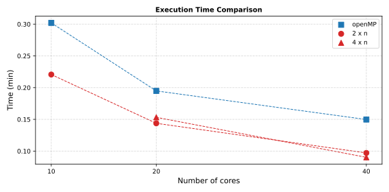

# Time Convergence – Parallel Scaling Performance

Steady-state heat conduction across a four-block two-material plate. The physical problem is kept simple and its mesh intentionally large so that wall-clock execution time is dominated by the solver work rather than I/O or initialisation overhead. The same 500-iteration pseudo-time run is repeated under eight parallelisation configurations — three shared-memory (openMP) and five distributed+shared-memory (MPI × openMP) — to assess the parallel scaling of FUSS.

---

## Problem setup

A rectangular plate (4.0 m × 0.2 m × 0.01 m) is partitioned into four equally-sized structured blocks in the X direction:

| Block | X extent (m) | Material | k (W/mK) | ρ (kg/m³) | c_v (J/kgK) |
|---|---|---|---|---|---|
| Block 1 | 0.0 – 1.0 | mat1 | 10.0 | 8000 | 450 |
| Block 2 | 1.0 – 2.0 | mat1 | 10.0 | 8000 | 450 |
| Block 3 | 2.0 – 3.0 | mat2 | 100.0 | 8000 | 450 |
| Block 4 | 3.0 – 4.0 | mat2 | 100.0 | 8000 | 450 |

Adjacent blocks are connected via `connection` (continuity) interfaces. No heat flux crosses the remaining faces (2-D plane geometry).

**Boundary conditions**

| Face | Location | Condition | Value |
|---|---|---|---|
| Face 1 – Block 1 | x = 0.0 m | Prescribed temperature – cold wall | T = 1000 K |
| Face 2 – Block 4 | x = 4.0 m | Prescribed temperature – hot wall  | T = 2000 K |
| All other faces   | y, z directions | Adiabatic (2-D plane) | q = 0 |

**Initial condition**

| Domain | T_init |
|---|---|
| All blocks | 1500 K (uniform) |

## Analytical solution

Since Blocks 1–2 and Blocks 3–4 share the same material, the domain reduces to two slabs in series. The steady-state heat flux is:

$$q = \frac{T_\text{hot} - T_\text{cold}}{L_\text{mat1}/k_1 + L_\text{mat2}/k_2} = \frac{2000 - 1000}{2.0/10 + 2.0/100} = \frac{1000}{0.22} \approx 4545\ \text{W/m}^2$$

The interface temperature at x = 2.0 m (Block 2 / Block 3 boundary) is:

$$T_\text{int} = T_\text{cold} + q\,\frac{L_\text{mat1}}{k_1} = 1000 + 4545 \times 0.2 \approx 1909\ \text{K}$$

The steady-state temperature profile is piecewise linear:

$$T(x) = \begin{cases} 1000 + 455\,x & 0 \le x \le 2.0\ \text{m} \\ 2000 - 45.5\,(4-x) & 2.0 \le x \le 4.0\ \text{m} \end{cases}$$

## Numerical setup

All cases use the same single simulation configuration:

| Parameter | Value |
|---|---|
| Time scheme | RK2 |
| VNN | 1.5 |
| Time-accurate | false |
| Integration variables | primitive |
| Implicit residual smoothing | enabled (β = 0.5) |
| Stopping criterion | iter-threshold = 500 |

## Grid structure

Each block is discretised with a uniform structured mesh of 1000 × 20 cells, giving a total of 80 000 cells across the four blocks:

| Block | Cells (nx × ny) | Δx (m) | Δy (m) |
|---|---|---|---|
| Block 1 | 1000 × 20 | 1.0 × 10⁻³ | 0.01 |
| Block 2 | 1000 × 20 | 1.0 × 10⁻³ | 0.01 |
| Block 3 | 1000 × 20 | 1.0 × 10⁻³ | 0.01 |
| Block 4 | 1000 × 20 | 1.0 × 10⁻³ | 0.01 |

## Parallelisation configurations

Eight configurations are tested, grouped by parallelisation strategy:

| Case | Strategy | MPI ranks | Threads/rank | Total cores |
|---|---|---|---|---|
| openMP-10  | Shared memory only | 1  | 10 | 10 |
| openMP-20  | Shared memory only | 1  | 20 | 20 |
| openMP-40  | Shared memory only | 1  | 40 | 40 |
| MPI-2x5   | Distributed + shared | 2  |  5 | 10 |
| MPI-2x10  | Distributed + shared | 2  | 10 | 20 |
| MPI-4x5   | Distributed + shared | 4  |  5 | 20 |
| MPI-2x20  | Distributed + shared | 2  | 20 | 40 |
| MPI-4x10  | Distributed + shared | 4  | 10 | 40 |

## Results

Wall-clock execution times for all eight configurations are shown below.

| Case | Total cores | Time (min) |
|---|---|---|
| openMP-10  | 10 | 0.302 |
| MPI-2x5   | 10 | 0.221 |
| openMP-20  | 20 | 0.195 |
| MPI-4x5   | 20 | 0.153 |
| MPI-2x10  | 20 | 0.144 |
| openMP-40  | 40 | 0.150 |
| MPI-2x20  | 40 | 0.097 |
| MPI-4x10  | 40 | 0.090 |

**Key observations**

- **MPI outperforms openMP at every core count.** At 20 cores, MPI-2x10 (0.144 min) is 26% faster than openMP-20 (0.195 min); at 40 cores, MPI-4x10 (0.090 min) is 40% faster than openMP-40 (0.150 min). The domain decomposition across ranks reduces the per-thread working set and improves cache reuse.
- **openMP scaling is sub-linear.** Going from 10 to 40 threads the speedup is only 2.0× (0.302 → 0.150 min) against the theoretical 4.0×, indicating memory-bandwidth saturation on the shared-memory node at high thread counts.
- **MPI scaling is more favourable.** The MPI-2x series achieves a 2.3× speedup from 10 to 40 cores (0.221 → 0.097 min); the MPI-4x series achieves 1.7× from 20 to 40 cores (0.153 → 0.090 min).
- **At equal core count, increasing ranks at the expense of threads-per-rank helps at 40 cores** (MPI-4x10 = 0.090 min vs MPI-2x20 = 0.097 min), suggesting that the finer domain decomposition of 4 ranks better balances the workload across the four mesh blocks.